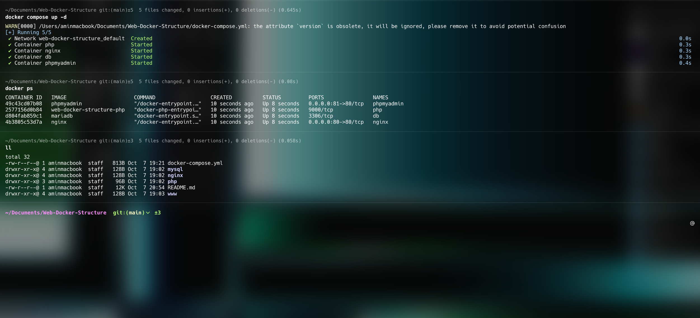

## 🐳 Dockerized Web Development Environment
### بخش فارسی در اخر داکیومنت قرار داده شده است

A clean, ready-to-use Docker-based setup for quickly spinning up a modern web development environment with minimal effort.

<p align="center"\>

</p\>

-----

### About This Project

This repository provides a fully dockerized stack tailored for **PHP** web development. With a single command, it launches a complete environment including:

  * Latest **NGINX** web server 
  * **PHP-FPM** runtime for PHP applications 🐘
  * **MySQL/MariaDB** database (with persistent sorage) 
  * **phpMyAdmin** GUI for database management 
  * **SSL** SSL with Certbot 

The goal is to help developers build, test, and debug their PHP-based projects in an isolated and reproducible environment without the hassle of manual server configuration.

-----

### Requirements

To use this project, ensure you have:

  * **Docker**
  * **Docker Compose** (version 2+)

Install them and tutorial via [Docker's official documentation](https://docs.docker.com/).

-----

### Quick Start (Installation & Setup) 🚀

This setup supports two modes: **Development** (quick start) and **Production** (with SSL via Let's Encrypt).

#### **1. Development Mode (Localhost, No SSL)**

Use this mode for local development and testing, without setting up domain or SSL certificates.

1.  **Clone the repository:**

    ```bash
    git clone https://github.com/amintoorchi/Web-Docker-Structure.git
    cd Web-Docker-Structure
    ```

2.  **Set Default Server_name in NginxConfig (./Web-Docker-Structure/nginx/conf.d):**

    ```bash
    server_name localhost;
    ```

3.  **Launch the Containers:**

    ```bash
    docker-compose up -d
    ```

4.  **Access services:**

      * Web app (HTTP): [http://localhost](localhost)
      * phpMyAdmin: [http://localhost:81](localhost:81)

#### **2. Production Mode (With Let's Encrypt SSL)**

Follow these steps to deploy the stack with a valid SSL certificate for your custom domain, suitable for staging or production.

1.  **Clone the repository** (if not already done):

    ```bash
    git clone https://github.com/amintoorchi/Web-Docker-Structure.git
    cd Web-Docker-Structure
    ```

2.  **Configure Environment Variables:**

      * Copy the example file:
        ```bash
        cp .env.example .env
        ```
      * **Edit the `.env` file** and set your **email** and **domain** (e.g., `YOUR_DOMAIN=example.com`, `YOUR_EMAIL=info@example.com`). These are crucial for the SSL certificate request.

3.  **Prepare the SSL Script:**

      * Grant execution permissions to the setup script:
        ```bash
        chmod +x setup-ssl.sh
        ```

4.  **Request the SSL Certificate:**

      * Run the script to generate and obtain the Let's Encrypt certificate:
        ```bash
        ./setup-ssl.sh
        ```
      * *Note: The script will temporarily start NGINX to complete the ACME challenge.*

5.  **Configure NGINX for SSL:**

      * Navigate to the NGINX configuration file: `nginx/conf.d/default.conf`.
      * **Modify/uncomment the necessary sections** (as instructed within the `default.conf` file) to enable SSL and point to the newly issued certificate files.
      * **Critical Security Note:** Ensure the **domain** and **email** values in `default.conf` (`server_name`) **exactly match** the values you entered in the `.env` file.

6.  **Final Launch with SSL:**

      * Stop and remove containers and volumes to ensure a clean launch:
        ```bash
        docker-compose down -v
        ```
      * Relaunch the stack to load the new NGINX configuration and apply the SSL certificate:
        ```bash
        docker-compose up -d
        ```

7.  **Access Secured Service:**

      * Web app (HTTPS): `https://your-domain.com`

-----

### Project Structure

The project is organized as follows:

| Directory/File | Description |
| :--- | :--- |
| `www/` | Your PHP/HTML/CSS/JS ... files (served by NGINX). |
| `mysql/` | Database configuration and initialization scripts (e.g., `init.sql` for schema). |
| `nginx/` | NGINX configuration files (e.g., `conf.d/` for server blocks). |
| `php/` | PHP-FPM Dockerfile and settings. |
| `docker-compose.yml` | Main configuration for all services. |
| `.env` | Environment variables (e.g., certbot credentials; ignored in `.gitignore`). |


Built with ❤️ by [Amin Toorchi](https://github.com/amintoorchi) for the open-source community.


-----

## 🐳 محیط توسعه وب داکریزه‌شده

یک محیط آماده و ساده برای راه‌اندازی سریع محیط توسعه وب مدرن با حداقل تلاش.

### درباره این پروژه

این مخزن یک stack کاملاً داکریزه‌شده برای توسعه وب **PHP** ارائه می‌دهد. با یک دستور، محیطی کامل شامل موارد زیر راه‌اندازی می‌شود:

  * وب‌سرور **NGINX** آخرین نسخه ⚙️
  * محیط اجرایی **PHP-FPM** برای برنامه‌های PHP 🐘
  * دیتابیس **MySQL/MariaDB** (با ذخیره‌سازی پایدار) 🐬
  * ابزار گرافیکی **phpMyAdmin** برای مدیریت دیتابیس 🛠️
  * ابزار گرافیکی **phpMyAdmin** برای مدیریت دیتابیس 🛠️
  * **Certbot** برای مدیریت و دریافت گواهی اس اس ال  🛠️

هدف، کمک به توسعه‌دهندگان برای ساخت، تست و دیباگ پروژه‌های PHP در محیطی ایزوله و قابل‌تکرار بدون دردسر تنظیمات دستی سرور است.

-----

### پیش‌نیازها

برای استفاده، نیاز دارید:

  * **Docker**
  * **Docker Compose** (نسخه ۲ یا بالاتر)

آن‌ها را از [مستندات رسمی داکر](https://docs.docker.com/) نصب کنید.

-----

### راه‌اندازی سریع (نصب و راه‌اندازی) 🚀

این ساختار از دو حالت پشتیبانی می‌کند: **توسعه (Development)** برای شروع سریع و **تولید (Production)** با گواهی SSL از Let's Encrypt.

#### **۱. حالت توسعه (Local، بدون SSL)**

از این حالت برای توسعه و تست محلی، بدون نیاز به تنظیم دامنه یا گواهی SSL استفاده کنید.

1.  **مخزن را کلون کنید:**

    ```bash
    git clone https://github.com/amintoorchi/Web-Docker-Structure.git
    cd Web-Docker-Structure
    ```

2.  **یک دامنه دلخواه با توجه با DNS داخلی سیستم خود ست کنید:**

    ```bash
    server_name localhost 127.0.0.1;
    ```

3.  **کانتینرها را راه‌اندازی کنید:**

    ```bash
    docker-compose up -d
    ```

4.  **به سرویس‌ها دسترسی پیدا کنید:**

      * برنامه وب (HTTP): [http://localhost](localhost)
      * phpMyAdmin: [http://localhost:81](localhost:81)

#### **۲. حالت تولید (با SSL از Let's Encrypt)**

این مراحل را برای راه‌اندازی با گواهی SSL معتبر برای دامنه سفارشی خود دنبال کنید، که برای محیط‌های استیجینگ یا تولید مناسب است.

1.  **مخزن را کلون کنید** (اگر قبلاً انجام نشده):

    ```bash
    git clone https://github.com/amintoorchi/Web-Docker-Structure.git
    cd Web-Docker-Structure
    ```

2.  **تنظیم متغیرهای محیطی:**

      * از فایل نمونه کپی بگیرید:
        ```bash
        cp .env.example .env
        ```
      * **فایل `.env` را ویرایش کنید** و **ایمیل** و **دامنه** خود را تنظیم کنید (مثلاً `YOUR_DOMAIN=example.com`، `YOUR_EMAIL=info@example.com`). این مقادیر برای درخواست گواهی SSL حیاتی هستند.

3.  **آماده‌سازی اسکریپت SSL:**

      * مجوز اجرای اسکریپت را بدهید:
        ```bash
        chmod +x setup-ssl.sh
        ```

4.  **دریافت گواهی SSL:**

      * اسکریپت را برای تولید و دریافت گواهی Let's Encrypt اجرا کنید:
        ```bash
        ./setup-ssl.sh
        ```
      * *توجه: اسکریپت به‌طور موقت NGINX را برای تکمیل چالش ACME راه‌اندازی می‌کند.*

5.  **تنظیم NGINX برای SSL:**

      * به فایل تنظیمات NGINX بروید: `nginx/conf.d/default.conf`.
      * **بخش‌های لازم را ویرایش/کامنت را بردارید** (مطابق دستورالعمل‌های داخل فایل `default.conf`) تا SSL فعال شود و به فایل‌های گواهی صادرشده اشاره کند.
      * **نکته امنیتی حیاتی:** مطمئن شوید که مقادیر **دامنه** و **ایمیل** در `default.conf` (`server_name` و مسیرهای SSL) **دقیقاً** با مقادیری که در فایل `.env` وارد کرده‌اید، مطابقت داشته باشد.

6.  **راه‌اندازی نهایی با SSL:**

      * کانتینرها و volumeها را متوقف و حذف کنید تا مطمئن شوید تنظیمات جدید NGINX اعمال می‌شود:
        ```bash
        docker-compose down -v
        ```
      * ساختار را مجدداً راه‌اندازی کنید تا کانفیگ NGINX جدید و گواهی SSL صادرشده بارگذاری شود:
        ```bash
        docker-compose up -d
        ```

7.  **دسترسی به سرویس ایمن:**

      * برنامه وب (HTTPS): `https://your-domain.com`

-----

### ساختار پروژه

ساختار پروژه به این صورت است:

| Directory/File | Description |
| :--- | :--- |
| `www/` | فایل‌های PHP/HTML/CSS/JS و ... (توسط NGINX سرو می‌شود). |
| `mysql/` | تنظیمات دیتابیس و اسکریپت‌های اولیه‌سازی (مثل `init.sql` برای اسکیما). |
| `nginx/` | فایل‌های تنظیمات NGINX (مثل `conf.d/` برای server blockها). |
| `php/` | فایل Dockerfile و تنظیمات PHP-FPM. |
| `docker-compose.yml` | تنظیمات اصلی همه سرویس‌ها. |
| `.env` | متغیرهای محیطی (مثل اعتبارنامه دیتابیس؛ در `.gitignore` نادیده گرفته شده).


طراحی و توسعه با ❤️ توسط [Amin Toorchi](https://github.com/amintoorchi) برای جامعه برنامه‌نویسان متن باز.
